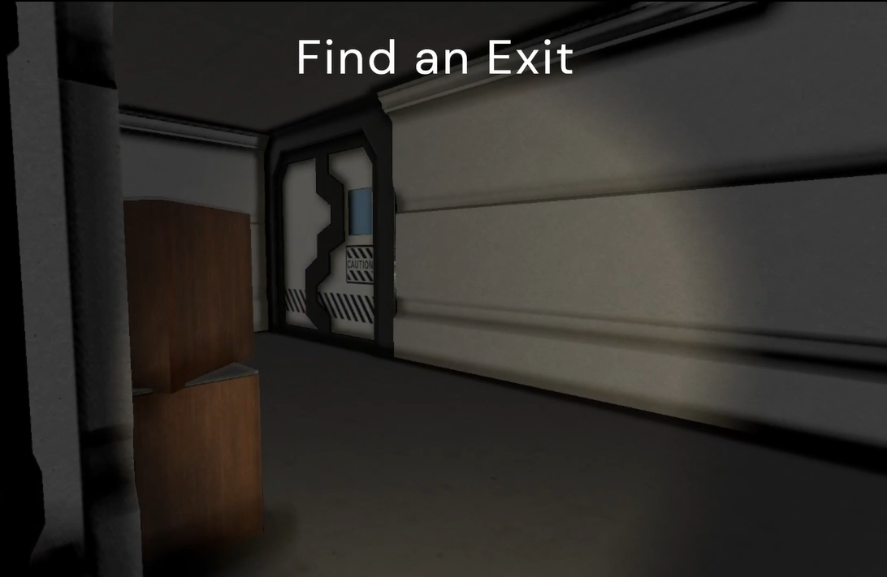
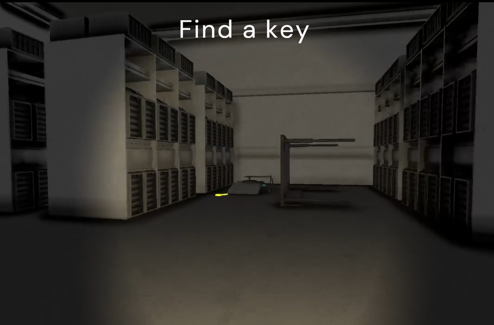
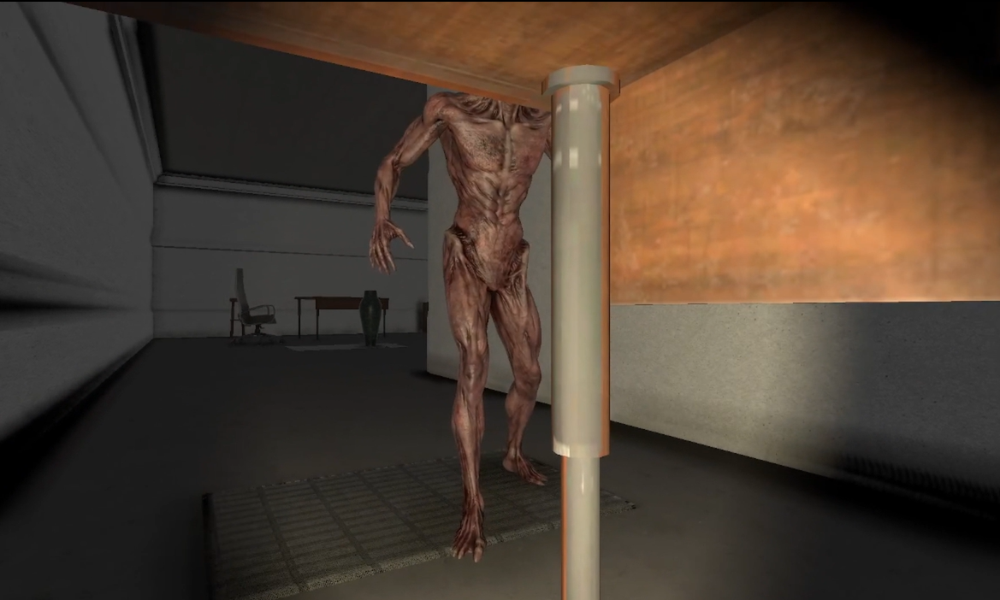
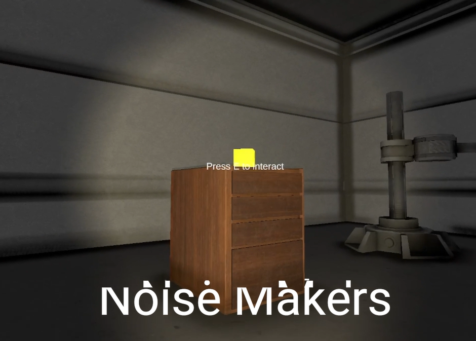
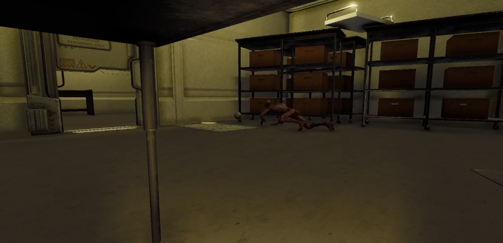

# Horror Stealth Game Prototype

A polished and atmospheric stealth-horror game inspired by *Alien: Isolation*, developed in Unity.

## Overview

Strategic Stealth Game where you must carefully navigate around the abandoned lab to find a key while avoiding what's trying to find you!
 
My aim was to make it impossible to cheese the AI, they can sense you with sound and sight and different mechanics are introduced such as crouching and noise makers to make you harder to spot and distract the enemy away. They have a suspicion meter that changes their states to become unpredictable and difficult to outsmart. You must be careful!

Designed for immersion, the game omits a traditional HUD in favor of environmental feedback and diegetic elements. Focused on player feedback, immersive interaction, and accessibility through minimal UI and audio cues

## Key Features

- **Collectibles**: Keys and sound-based distraction tools like noisemakers enhance tactical options.
- **Enemy AI**: A patrolling, reactive enemy adds pressure and unpredictability. investigates if the suspicion meter is too high - based on how the player is navigating
- **Progressive Difficulty**: Increasingly complex levels and challenges as you progress.
- **Visual Polish**: Custom art assets and animations with atmospheric lighting and sound.

## Screenshots

  
| Exit Point | Key Pickup | Hide Mechanic |
|------------|------------|----------------|
|  |  |  |

| Noisemaker | Thrown Noisemaker |
|------------|-------------------|
|  |  |

## Design & Development Notes

- Built in **Unity**, using C# scripts with serialized inspector parameters.
- Structured in multiple **scenes**, using prefab architecture for maintainability.
- Includes a **trailer video** showcasing highlights and mechanics.
- Development guided by **Gestalt principles**, stealth mechanics theory, and user feedback.

## Tools Used

- **Unity** – Game engine
- **C#** – Scripting
